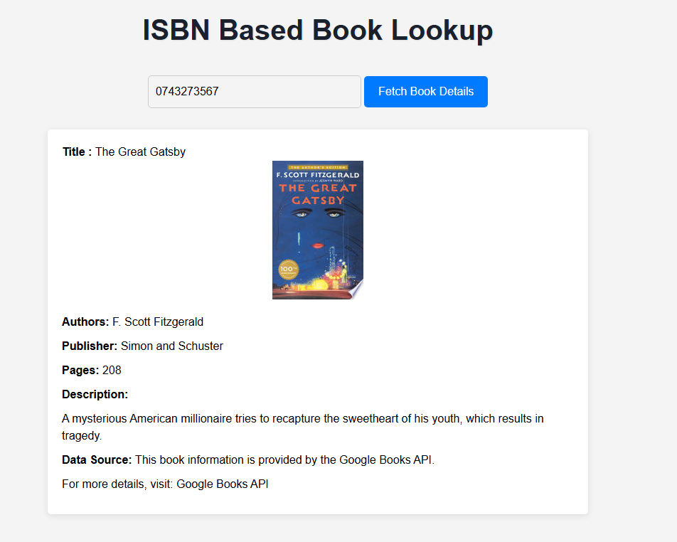
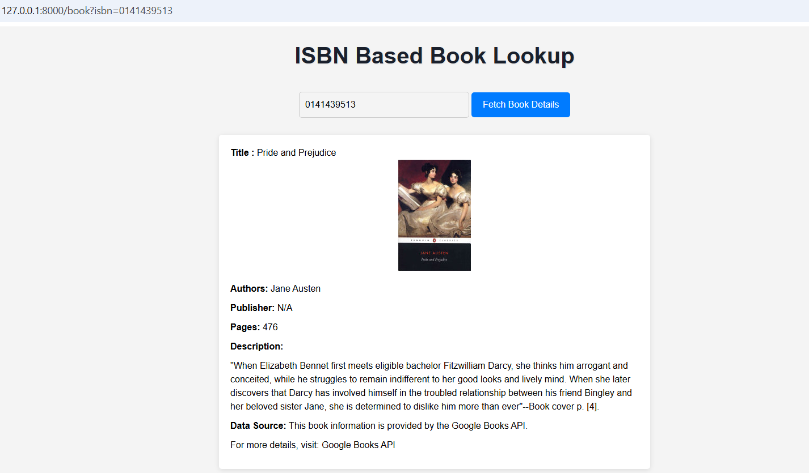
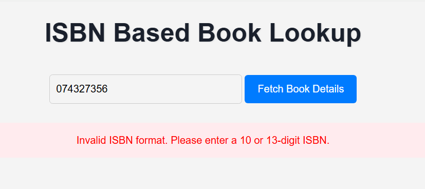

# Mybooks - ISBN Book Lookup

This is a Laravel application that allows users to look up book details by ISBN using the Google
Books API. The app fetches book information and caches results in a database for 1 hour to
improve performance. The interface is styled with custom CSS served via Vite.

## Features

```
● Input a 10 or 13-digit ISBN to fetch book details.
● Validates ISBN format and handles errors (e.g., invalid ISBN, no book found).
● Caches results in a database (cache table) to reduce API calls.
● Responsive design with a clean, modern UI.
● Centralized API configuration (config/api.php) and validation rules (app/Http/Requests/BookSearchRequest.php).
```
## Prerequisites
```
● PHP >= 8.
● Composer
● Node.js >= 16 and npm
● MySQL (or another database supported by Laravel)
● Git
```
## Installation

1. **Clone the Repository** :
```
git clone https://github.com/vici-harsh/isbn-book-lookup.git
cd isbn-book-lookup
```
2. **Install PHP Dependencies** :
```
composer install
```
3. **Install Node.js Dependencies** :
```
npm install
```


4. Update .env with your database details:
```
APP_URL=http://127.0.0.1: 8000
DB_CONNECTION=mysql
DB_HOST=127.0.0.
DB_PORT= 3306
DB_DATABASE=your_database
DB_USERNAME=your_username
DB_PASSWORD=your_password
CACHE_STORE=database
```

5. **Set Up Database** :
● Create the database (e.g., via MySQL CLI: CREATE DATABASE
your_database;).
● Run migrations to create the cache table for caching:
```
php artisan cache:table
php artisan migrate
```
6. **Compile Assets** :
```
npm run dev
```
7. **Start the Laravel Server** :
```
php artisan serve
```
8. **Run Vite for Development** :
```
npm run dev
```
9. **Access the App** :
● Open [http://127.0.0.1:8000](http://127.0.0.1:8000) in your browser.
● Enter an ISBN (e.g., 9780141439518) and click "Fetch Book Details".

## Configuration
● API URL: The Google Books API URL is defined in config/api.php. Update base_url or query_param there if needed:
```
'google_books' => [
    'base_url' => 'https://www.googleapis.com/books/v1/volumes',
    'query_param' => 'q=isbn:',
    'timeout' => 10,
]
```
● Validation: ISBN validation rules are in app/Http/Requests/BookSearchRequest.php. Update rules or messages there.

## Testing :

● 1) The Great Gatsby: 0743273567 (ISBN-10) :



● 2. Pride and Prejudice: 0141439513 (ISBN-10)



● 3. Failure Case:


